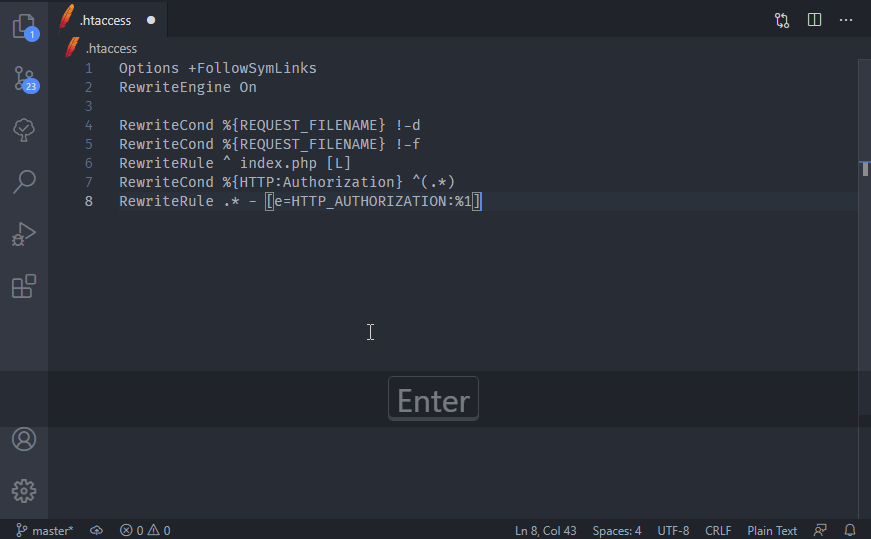
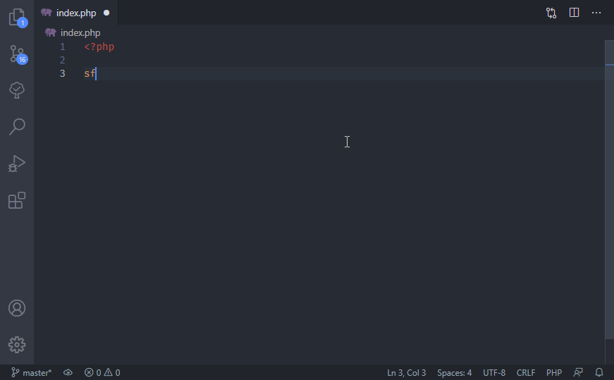
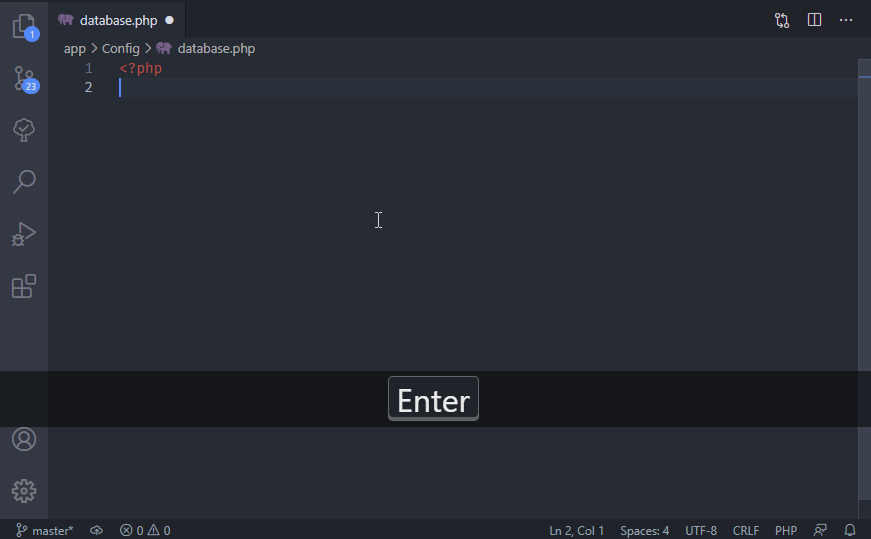
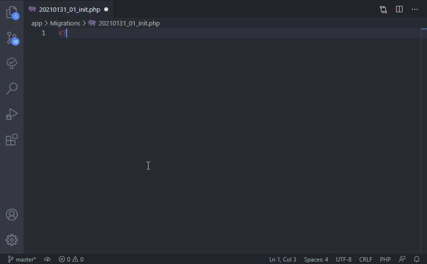
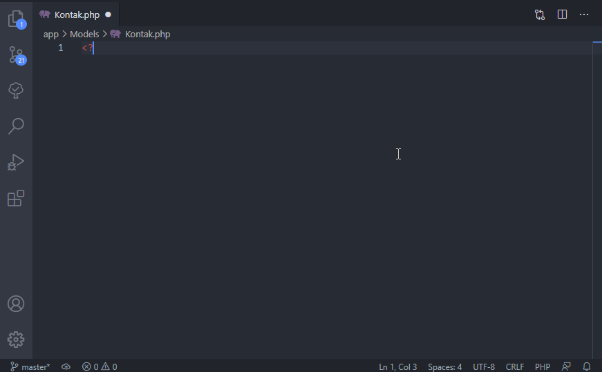
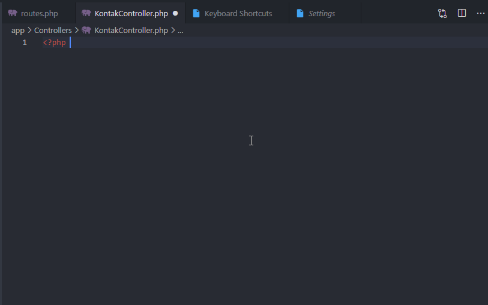
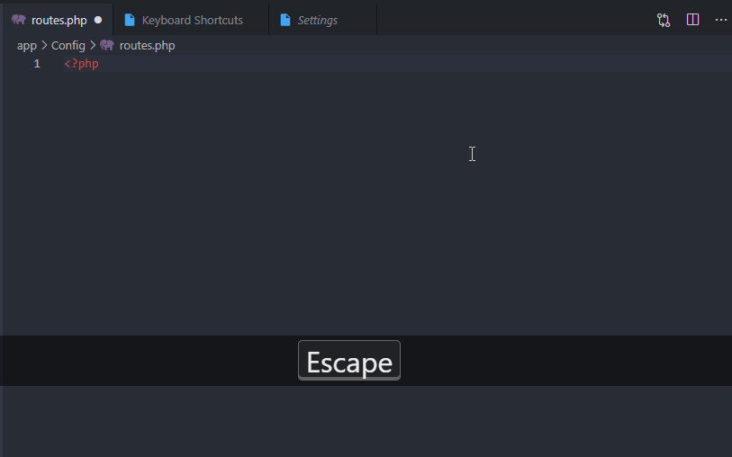

# Wajek Snippets

Wajek Code Snippets Collection for faster coding experience using Wajek Framework System

## Features

### htaccess

auto generate .htaccess file with snippets

### Index

auto generate index.php file

### Database

auto generate database configuration script

### Migration

auto generate migration template

### Model

auto generate model script

### Controller

auto generate CRUD Controller

### Generate CRUD Routes

auto generate CRUD routes

## Release Notes

### 0.0.1

Initial release

- index
- migration
- database
- controller
- routes
- model
- htaccess